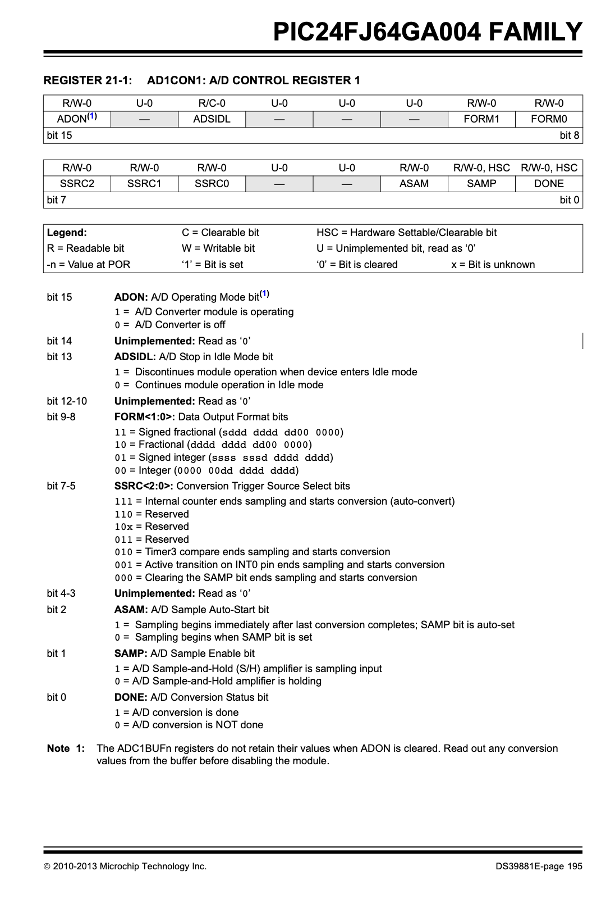
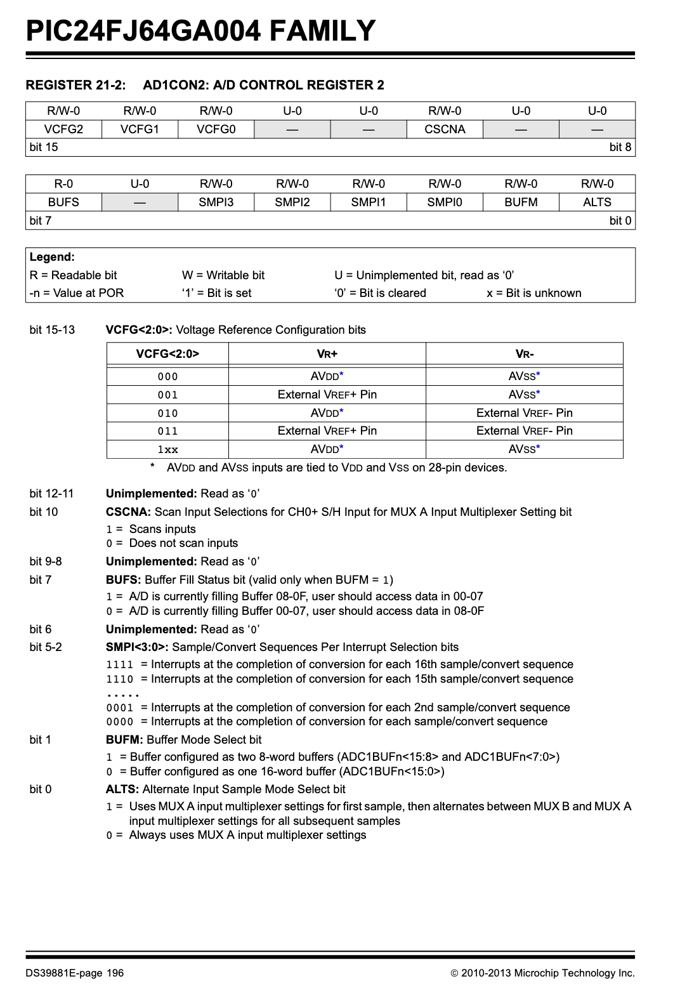
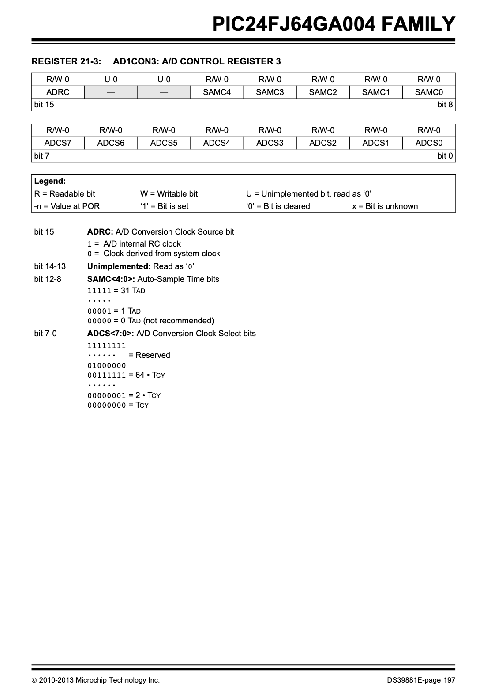
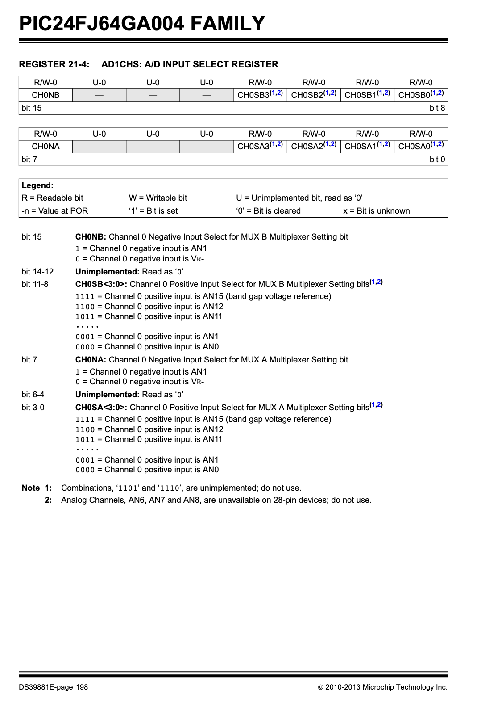
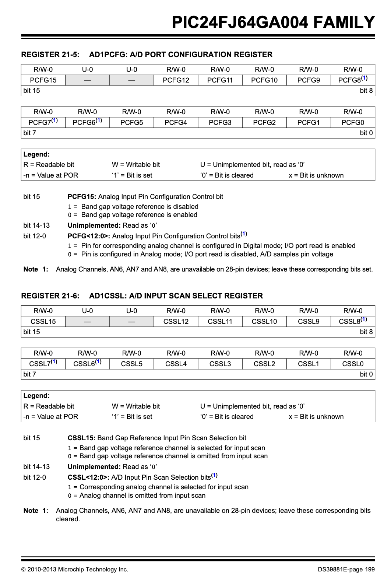

# Diagrams

PDF of PIC24 DataSheet: https://www.microchip.com/content/dam/mchp/documents/OTH/ProductDocuments/DataSheets/39881e.pdf

# ADC Configuration Pages

 <!--  -->

## Changelog

### 4/16/25 Log:

- Checked out hardware: observed expected values for 5V, 3.3V, Vref+, Vref-, amplifier output using DMM
- Programmed with EE2361 Lab 6 Code with 3 changes:
    - `AD1CON2bits.VCFG = 0b011;   // Use external reference pins`
    - `TRISBbits.TRISB12 = 1;              // set pin 23 to input`
    - `AD1PCFGbits.PCFG12 = 0;     // setup I/O for pin 23`
- Changed Vref+ (pin 2) and Vref- (pin 3) to be analog inputs
- Changed ADCBUF0 to ADCBUFC because using pin AN12
    
    ^ Might want to revert? It did not make a considerable positive difference.
    - If we set our read to AN0, we read our max as expected.
