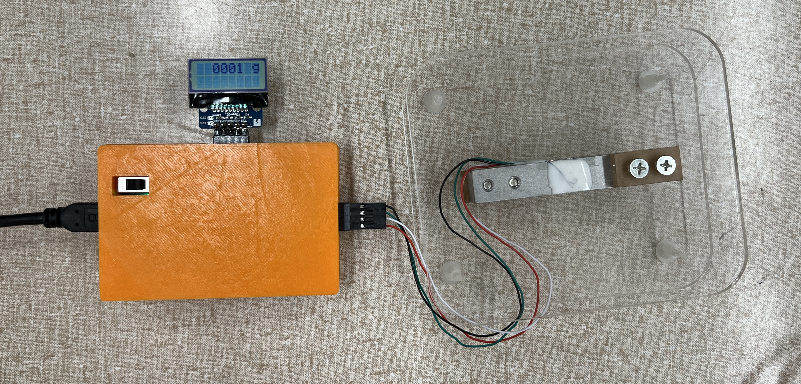
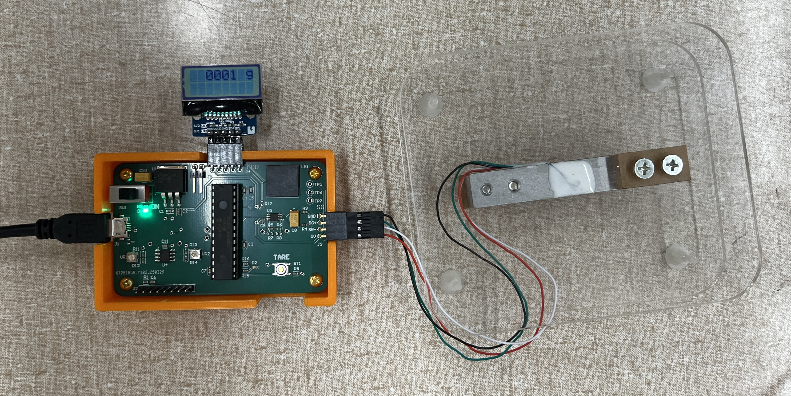
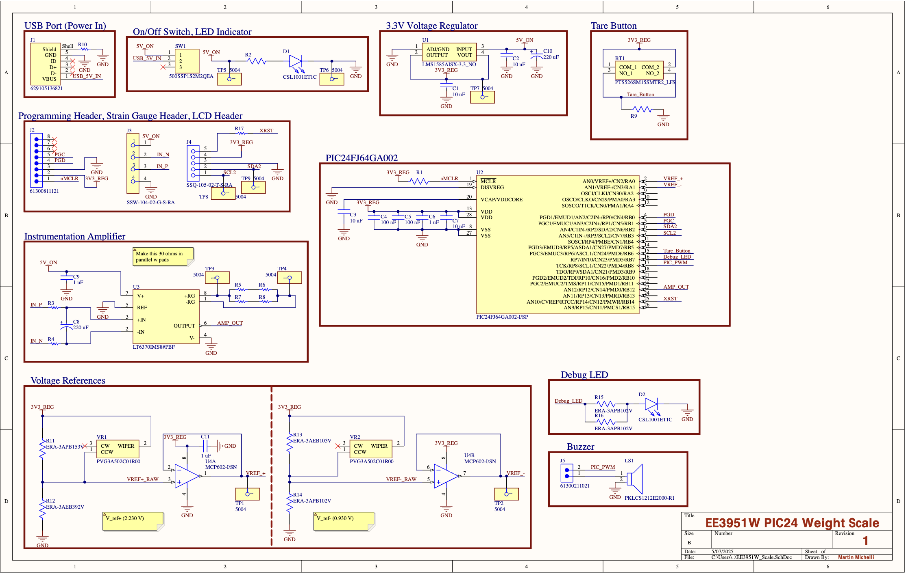

# PIC24_Scale

This EE3951W Junior Design Project featured a PIC24 microcontroller combined with a strain gauge to create a weight scale with gram level accuracy. We also incorporated a 3D printed enclosure for aesthetics and a tare button for practical use. 

## Design

<!--
<html>
<head>
  
</head>

<body>
  <x-model class="model" src="/docs/obj/scale_3d_object.obj"></x-model>

  
  
  
</body>
</html> -->

<!-- https://github.com/keithclark/3d-model-element/blob/master/readme.md>-->

Our strain gauge scale incorporated a WWZMDiB full-bridge strain gauge, an LT6370 instrumentation amplifier, and a PIC24 microcontroller for signal processing. This instrumentation amplifier was chosen because of the large gain range (1 to 10,000 V/V), a small (50 µV) input offset voltage, and a low (100 dB) minimum common-mode rejection ratio. The ADC on the PIC24 was used as the 10-bit accuracy was enough for gram distinction. An LCD display (I2C interface) displayed the measured weight in near-real time, and the device featured a tare function to account for container weight. The PCB was housed in a custom 3D-printed enclosure, and power was supplied via Micro USB with a 3.3V voltage regulator.

## Schematic

## Parts List

| Component                                   | Manufacturer       | Part Number         | Description                              | Quantity | Price         |
| ------------------------------------------- | ------------------ | ------------------- | ---------------------------------------- | -------- | ------------- |
| Microcontroller                             | Microchip          | PIC24FJ64GA002-I/SP | General Purpose Microcontroller          | 1        | $4.35         |
| DIP Socket                                  | Mill-Max           | ED90600-ND          | Socket for PIC Microcontroller           | 1        | $3.09         |
| PIC Programming Header                      | Wurth Elektronik   | 61300811121         | 8 Position 2.54mm Through Hole Connector | 1        | $0.36         |
| Input Power                                 | Wurth Elektronik   | 629105136821        | Right Angle Micro-USB Port               | 1        | $1.16         |
| On/Off Switch                               | E-Switch           | 500SSP1S2M2QEA      | 5A 28VDC Switch                          | 1        | $3.67         |
| 3.3V Regulator                              | Texas Instruments  | LMS1585AISX-3.3_NO  | Fixed 3.3V Regulator 5A                  | 1        | $2.83         |
| Strain Gauge Port                           | Samtec Inc.        | SSW-104-02-G-S-RA   | 4 Position 2.54mm Socket Connector       | 1        | $1.69         |
| 10 uF Capacitor                             | Murata             | GRM188R60J106ME47D  | 10% 6.3V 0603 Ceramic Capacitor          | 4        | $0.40         |
| 1 uF Capacitor                              | Murata             | GCM188R71E105KA64D  | 10% 25V 0603 Ceramic Capacitor           | 2        | $0.36         |
| 0.1 uF Capacitor                            | Murata             | GRM188R72A104KA35D  | 10% 100V 0603 Ceramic Capacitor          | 3        | $0.42         |
| 10 kOhm Resistor                            | YAGEO              | RC0603FR-0710KL     | 10% 1/10W 0603 Chip Resistor             | 1        | $0.10         |
| 1 kOhm Resistor                             | YAGEO              | RC0603FR-071KL      | 1% 1/10W 0603 Chip Resistor              | 1        | $0.10         |
| 10 Ohm Resistor                             | YAGEO              | RC0603FR-0710RL     | 1% 1/10W 0603 Chip Resistor              | 2        | $0.24         |
| 0 Ohm Jumper                                | YAGEO              | RC0603JR-070RL      | 0603 Footprint for optional resistors    | 6        | $0.60         |
| Indicator LED                               | Rohm Semiconductor | CSL1001ET1C         | 3V 0603 Green LED                        | 1        | $0.48         |
| Instrumentation Amplifier                   | Analog Devices     | LT6370IMS8#PBF      | Instrumentation Amplifier                | 1        | $8.66         |
| LCD Port                                    | Samtec Inc.        | SSQ-105-02-T-S-RA   | 5 Position 2.54mm Socket Connector       | 1        | $0.92         |
| 220 uF Capacitor                            | Kyocera AVX        | TAJC227K006RNJ      | 220 uF 10% 6.3V                          | 2        | $1.60         |
| 10 KOhm (Vref)                              | Panasonic          | ERA-3AEB103V        | 10 KOhm 0.1% 1/10 W 0603                 | 1        | $0.10         |
| 15 KOhm (Vref)                              | Panasonic          | ERA-3APB153V        | 15 KOhm 0.1% 1/10 W 0603                 | 1        | $0.10         |
| 1 KOhm (Vref)                               | Panasonic          | ERA-3APB102V        | 1 KOhm 0.1% 1/10 W 0603                  | 1        | $0.10         |
| 3.9 KOhm (Vref)                             | Panasonic          | ERA-3AEB392V        | 3.9 KOhm 0.1% 1/10 W 0603                | 1        | $0.10         |
| 5 KOhm Potentiometer                        | Bourns Inc.        | PVG3A502C01R00      | Trimmer 5KOhm 0.25W                      | 2        | $2.46         |
| 20 Ohm (Gain Setting)                       | Vishay Dale        | TNPW060320R0BEEA    | 20 Ohm 0.1% 0.21W 0603                   | 1        | $0.33         |
| 10 Ohm (Gain Setting)                       | Stackpole          | RNCF0603AKT10R0     | 10 Ohm 0.05% 1/10W 0603                  | 1        | $0.69         |
| Dual Op-Amp                                 | Microchip          | MCP602-I/SN         | Voltage Reference Buffer                 | 1        | $0.74         |
| Tare Button                                 | C&K                | PTS526SM15SMTR2 LFS | Tactile SPST 0.05 A 12V                  | 1        | $0.13         |
| Buzzer                                      | Murata             | PKLCS1212E2000-R1   | Piezoelectric Buzzer                     | 1        | $1.20         |
| Jumper Pins                                 | Wurth Elektronik   | 61300211021         | Right Angle Jumper Pins 0.254 mm         | 1        | $0.31         |
| Jumper Connector                            | Sullins            | QPC02SXGN-RC        | Shorting Jumper Connector 0.254 mm       | 1        | $0.04         |
| Test Point                                  | Keystone           | 5001                | Test Points                              | 10       | $0.29         |
| -                                           | -                  | -                   | -                                        | -        | -             |
| <b>Total Cost Estimate (Excluding PCB):</b> | -                  | -                   | -                                        | -        | <b>$37.62</b> |

## References

PIC24 Models: https://www.digikey.com/en/models/1228585

[PIC24 Datasheet](./docs/datasheets/PIC24.pdf)

PIC24 Digikey Link: https://www.digikey.com/en/products/detail/microchip-technology/PIC24FJ64GA002-I-SP/1228585
